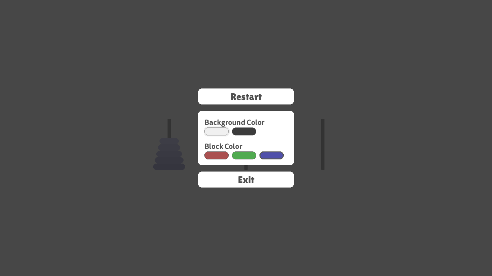

# Game: Tower of Hanoi
The goal of this game is to move all the blocks from *Tower 1* to *Tower 3*. 
But you cannot place larger block onto smaller block.

## Minimum Moves Required
Minimum moves required to complete the game is:
$$
    2n -1
$$
where, $n$ is number of blocks in *Tower 1*, at the beginning of the game.

## Screenshots

.png)
.png)

  

---
***Note:** This is an old project uploaded directly on GitHub*
